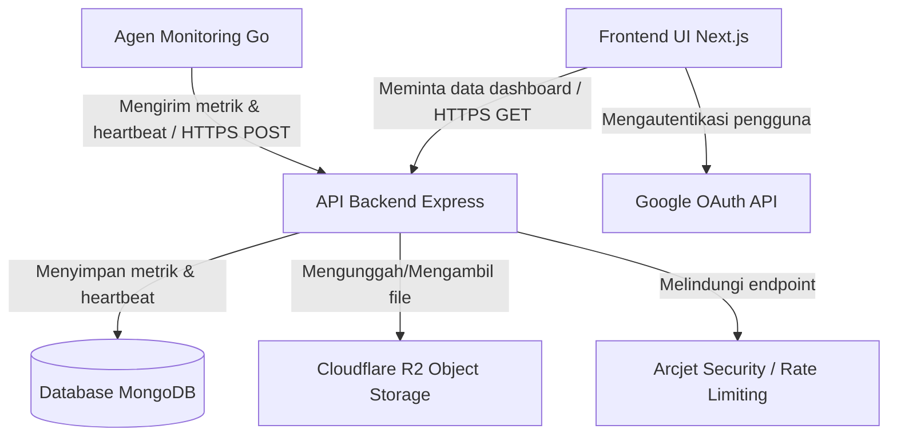

# SYMON (System Monitoring Server, Log, dan Manajemen Data)

SYMON adalah sistem monitoring hardware full-stack yang ringan, dirancang untuk memantau dan memvisualisasikan metrik sumber daya sistem (penggunaan CPU, RAM, dan Disk) di berbagai mesin. Proyek ini memiliki agen latar belakang berbasis Go yang berjalan sebagai layanan sistem (system service), backend API Node.js/Express, dan dashboard frontend berbasis Next.js.

---

## Arsitektur Sistem



---

## Daftar Isi

- [Fitur](#fitur)
- [Struktur Proyek](#struktur-proyek)
- [Menjalankan Secara Lokal](#menjalankan-secara-lokal)
  - [Prasyarat](#prasyarat)
  - [Pengaturan Backend (be)](#1-pengaturan-backend-be)
  - [Pengaturan Frontend (fe)](#2-pengaturan-frontend-fe)
  - [Pengaturan Agen Go (agent)](#3-pengaturan-agen-go-agent)
- [Panduan Penerapan (Deployment)](#panduan-penerapan-deployment)
  - [Database MongoDB](#1-database-mongodb)
  - [Penerapan API Backend](#2-penerapan-api-backend)
  - [Penerapan Frontend Next.js](#3-penerapan-frontend-nextjs)
  - [Cloudflare R2 Object Storage](#4-cloudflare-r2-object-storage)
  - [Penerapan Agen Monitoring Go](#5-penerapan-agen-monitoring-go)
- [Teknologi yang Digunakan (Built With)](#teknologi-yang-digunakan-built-with)
- [Lisensi](#lisensi)

---

## Fitur

- **Pelacakan Metrik Real-Time:** Pencatatan terus-menerus untuk persentase penggunaan CPU, penggunaan RAM (persentase dan GB), serta penggunaan Disk (persentase dan GB).
- **Layanan Latar Belakang Go:** Agen sistem ringan yang dibuat menggunakan Go, memanfaatkan library `gopsutil` untuk pengambilan metrik dengan overhead rendah dan `kardianos/service` untuk menjalankan agen sebagai daemon/layanan sistem di Windows, Linux, dan macOS.
- **Visualisasi Dashboard Interaktif:** Statistik langsung dan grafik riwayat data yang dibuat menggunakan **Next.js 16**, **Tailwind CSS v4**, **Recharts**, dan **Framer Motion**.
- **Autentikasi Aman:** Login pengguna yang terintegrasi menggunakan Google OAuth API dan **NextAuth.js**.
- **Keamanan Endpoint yang Kuat:** Sistem pembatasan laju request (rate limiting) dan deteksi bot otomatis menggunakan middleware **Arcjet**.
- **Penyimpanan File Skalabel:** Menggunakan **Cloudflare R2** (API yang kompatibel dengan S3) dengan mekanisme pembuatan presigned URL untuk proses upload/download file secara aman dan berkinerja tinggi.

---

## Struktur Proyek

```text
├── agent/                  # Agen Monitoring Go
│   ├── main.go             # Logika eksekusi agen & manajemen layanan (service)
│   ├── go.mod              # Dependensi Go
│   └── agent-windows.exe   # File eksekusi terkompilasi untuk Windows
├── be/                     # API Backend Express
│   ├── config/             # Konfigurasi DB, Arcjet, mailer, dan env
│   ├── controllers/        # Handler request API
│   ├── middleware/         # Auth, keamanan Arcjet, dan penanganan error
│   ├── models/             # Schema Mongoose (Machine, Metrics, Users)
│   ├── repositories/       # Layer akses database
│   ├── routes/             # Routing endpoint API
│   ├── services/           # Logika bisnis inti
│   ├── utils/              # Helper utility
│   ├── validations/        # Validator request menggunakan Zod
│   ├── dockerfile          # Konfigurasi container Docker
│   ├── index.js            # Entrypoint utama aplikasi backend
│   └── seed-dummy.js       # Script untuk seeding data dummy database
└── fe/                     # Aplikasi Frontend Next.js
    ├── app/                # Halaman Next.js (App Router)
    ├── components/         # Komponen UI reusable
    ├── features/           # Komponen UI terspesialisasi
    ├── lib/                # Library bersama (NextAuth, dll.)
    ├── open-next.config.ts # Konfigurasi builder OpenNext
    ├── wrangler.jsonc      # Konfigurasi deployment Cloudflare Pages
    └── package.json        # Dependensi dan script NPM frontend
```

---

## Menjalankan Secara Lokal

### Prasyarat

Pastikan Anda telah menginstal software berikut di mesin lokal Anda:
- **Node.js 22** (LTS) & NPM
- **Go 1.21** atau versi terbaru (untuk mengompilasi agen)
- **MongoDB** (Lokal atau database cloud MongoDB Atlas)
- **Redis** server

### 1. Pengaturan Backend (`be`)

1. Masuk ke direktori `be`:
   ```bash
   cd be
   ```

2. Instal paket-paket node:
   ```bash
   npm install
   ```

3. Buat file `.env.development.local` di dalam folder `be`. Gunakan templat berikut sebagai acuan:
   ```env
   PORT=3030
   DB_URI=mongodb+srv://<user>:<password>@cluster.mongodb.net/si-mondhog
   JWT_SECRET=rahasia_tanda_tangan_jwt_anda
   JWT_EXPIRES_IN=1d
   DOWNLOAD_TOKEN_SECRET=rahasia_token_unduhan_aman_anda
   
   # Keamanan (Arcjet)
   ARCJET_KEY=ajkey_xxxxxxxxxxxxxxxxxxxxxxxxxx
   ARCJET_ENV=development
   
   # Autentikasi Google
   GOOGLE_CLIENT_ID=google-oauth-client-id-anda.apps.googleusercontent.com
   GOOGLE_CLIENT_SECRET=google-oauth-client-secret-anda
   GOOGLE_REFRESH_TOKEN=google-refresh-token-anda
   
   # Cloudflare R2 Object Storage (Opsional untuk lokal)
   R2_ACCOUNT_ID=cloudflare-account-id-anda
   R2_ACCESS_KEY_ID=r2-access-key-id-anda
   R2_SECRET_ACCESS_KEY=r2-secret-access-key-anda
   R2_BUCKET_NAME=nama-bucket-r2-anda
   R2_SIGNED_URL_EXPIRES=3600
   
   # Konfigurasi CORS
   FRONTEND_BASE_URL=http://localhost:3000
   ```

4. Jalankan server pengembangan (development server):
   ```bash
   npm run dev
   ```
   Backend akan berjalan di `http://localhost:3030`. Anda dapat melihat dokumentasi API Swagger di `http://localhost:3030/api-docs`.

5. *(Opsional)* Tanam data metrik dummy untuk menguji visualisasi grafik pada dashboard:
   ```bash
   node seed-dummy.js
   ```

---

### 2. Pengaturan Frontend (`fe`)

1. Masuk ke direktori `fe`:
   ```bash
   cd ../fe
   ```

2. Instal paket-paket node:
   ```bash
   npm install
   ```

3. Buat file `.env` di dalam folder `fe` dengan variabel berikut:
   ```env
   GOOGLE_CLIENT_ID="google-oauth-client-id-anda.apps.googleusercontent.com"
   GOOGLE_CLIENT_SECRET="google-oauth-client-secret-anda"
   NEXTAUTH_SECRET="kunci-rahasia-enkripsi-sesi-nextauth"
   NEXTAUTH_URL="http://localhost:3000"
   NEXT_PUBLIC_API_URL="http://localhost:3030/api"
   ```

4. Jalankan server pengembangan:
   ```bash
   npm run dev
   ```
   Buka `http://localhost:3000` di web browser Anda.

---

### 3. Pengaturan Agen Go (`agent`)

Untuk menjalankan agen secara lokal, Anda memerlukan **token aktivasi** yang dibuat melalui Sesi Pengguna di Dashboard Frontend.

1. Masuk ke direktori `agent`:
   ```bash
   cd ../agent
   ```

2. Aktifkan dan daftarkan agen ke backend lokal Anda:
   
   Pertama, sesuaikan baris 22 di `main.go` agar mengarah ke endpoint API lokal jika diperlukan:
   ```go
   const backendURL = "http://localhost:3030/api/agent"
   ```
   
   Kemudian jalankan agen dengan menyertakan token aktivasi:
   ```bash
   go run main.go -activation <TOKEN_AKTIVASI_ANDA>
   ```

3. Setelah berhasil diaktivasi, agen akan menghasilkan file `config.json` di direktori khusus sistem operasi dan mendaftarkan mesin host. Selanjutnya, Anda dapat menjalankan loop pengiriman metrik secara langsung:
   ```bash
   go run main.go
   ```

---

## Panduan Penerapan (Deployment)

### 1. Database MongoDB
Deploy database MongoDB Anda ke **MongoDB Atlas** (Cloud Database) atau siapkan instance MongoDB mandiri:
- Dapatkan connection string (`DB_URI`), dan pastikan konfigurasi firewall mengizinkan akses dari alamat IP server backend API Anda.
- Tambahkan index pada field `machineId` dan `timestamp` di koleksi `MachineMetrics` untuk menjaga performa query tetap cepat.

---

### 2. Penerapan API Backend

Aplikasi backend Node.js/Express ini dapat dideploy ke platform cloud hosting berbasis kontainer (seperti **Render**, **Railway**, **AWS ECS**, atau **DigitalOcean App Platform**) menggunakan Docker.

#### Dockerfile Produksi
Gunakan konfigurasi `dockerfile` multi-stage berikut pada `be/dockerfile` untuk optimasi ukuran image produksi:
```dockerfile
# --- Tahap Build ---
FROM node:22-alpine AS builder
WORKDIR /app
COPY package*.json ./
RUN npm ci
COPY . .

# --- Tahap Runner (Produksi) ---
FROM node:22-alpine AS runner
WORKDIR /app
COPY package*.json ./
RUN npm ci --only=production
COPY --from=builder /app /app

ENV NODE_ENV=production
ENV PORT=3030

EXPOSE 3030
CMD ["node", "index.js"]
```

#### Langkah-langkah Penerapan:
1. Build image Docker:
   ```bash
   docker build -t si-mondhog-backend ./be
   ```
2. Jalankan secara lokal untuk pengujian kontainer:
   ```bash
   docker run -p 3030:3030 --env-file ./be/.env.production.local si-mondhog-backend
   ```
3. Push image Docker ke registry Anda (misalnya Docker Hub / AWS ECR) dan deploy di cloud provider Anda. Pastikan untuk memasukkan semua variabel lingkungan (env) dari template `.env.development.local` ke panel konfigurasi penyedia layanan cloud Anda.

---

### 3. Penerapan Frontend Next.js

Aplikasi frontend Next.js ini dikonfigurasi untuk dideploy ke **Cloudflare Pages / Workers** menggunakan bantuan **OpenNext**.

1. Masuk ke direktori `fe`:
   ```bash
   cd fe
   ```
2. Hubungkan akun Cloudflare Anda via Wrangler CLI:
   ```bash
   npx wrangler login
   ```
3. Kompilasi dan deploy proyek:
   ```bash
   npm run deploy
   ```
   Perintah ini akan mem-build aplikasi Next.js menggunakan OpenNext dan secara otomatis mengunggah aset statis serta kode worker ke jaringan Cloudflare.
4. Jangan lupa untuk memasukkan variabel lingkungan (`GOOGLE_CLIENT_ID`, `GOOGLE_CLIENT_SECRET`, `NEXTAUTH_SECRET`, `NEXTAUTH_URL`, `NEXT_PUBLIC_API_URL`) di dalam Dashboard Cloudflare bagian Pages project Settings -> Environment Variables.

---

### 4. Cloudflare R2 Object Storage
Untuk menyimpan berkas unggahan, buat dan konfigurasi Bucket di Cloudflare R2:
1. Masuk ke dashboard Cloudflare -> **R2 Object Storage** lalu klik **Create bucket**.
2. Atur kebijakan CORS di bucket tersebut agar domain frontend Anda dapat melakukan upload file secara aman. Contoh konfigurasi CORS:
   ```json
   [
     {
       "AllowedHeaders": ["*"],
       "AllowedMethods": ["PUT", "POST", "GET", "HEAD", "DELETE"],
       "AllowedOrigins": ["https://domain-frontend-anda.com"],
       "ExposeHeaders": ["ETag", "x-amz-meta-custom-header"]
     }
   ]
   ```
3. Buat kredensial **S3 API Credentials** (Access Key ID dan Secret Access Key) melalui halaman pengaturan R2 dan pasangkan nilai tersebut ke variabel lingkungan backend API (`R2_ACCESS_KEY_ID`, `R2_SECRET_ACCESS_KEY`, dll.).

---

### 5. Penerapan Agen Monitoring Go

Untuk memasang agen di server target yang ingin dipantau, kompilasi kode Go sesuai dengan sistem operasi server target, daftarkan dengan token aktivasi, dan pasang sebagai layanan latar belakang yang berjalan terus-menerus.

#### Kompilasi (Cross-Compile)
Jalankan perintah ini dari folder `agent` untuk membuat file binary sesuai platform server target:

- **Windows:**
  ```bash
  GOOS=windows GOARCH=amd64 go build -o agent-windows.exe main.go
  ```
- **Linux:**
  ```bash
  GOOS=linux GOARCH=amd64 go build -o agent-linux main.go
  ```
- **macOS:**
  ```bash
  GOOS=darwin GOARCH=amd64 go build -o agent-macos main.go
  ```

#### Aktivasi & Pemasangan Layanan di Server Target
Pindahkan file hasil kompilasi ke server tujuan dan jalankan perintah di bawah ini dengan hak akses administrator/root.

1. **Aktivasi Agen:** Jalankan file dengan menyertakan token aktivasi yang dibuat dari dashboard web:
   ```bash
   # Di Linux/macOS
   sudo ./agent-linux -activation <TOKEN_AKTIVASI_DASHBOARD>
   
   # Di Windows (Buka Command Prompt / PowerShell sebagai Administrator)
   .\agent-windows.exe -activation <TOKEN_AKTIVASI_DASHBOARD>
   ```
   
   *Perintah ini akan mendaftarkan spesifikasi server ke backend, menyimpan kunci konfigurasi secara lokal, menginstal agen sebagai layanan sistem otomatis, dan langsung memulainya.*

2. **Mengelola Layanan Latar Belakang:**
   - **Menghentikan Layanan (Stop):**
     ```bash
     sudo ./agent-linux stop
     # ATAU (Windows Admin)
     .\agent-windows.exe stop
     ```
   - **Menghapus Layanan & Konfigurasi (Uninstall):**
     ```bash
     sudo ./agent-linux uninstall
     # ATAU (Windows Admin)
     .\agent-windows.exe uninstall
     ```

3. **Lokasi Penyimpanan Konfigurasi Lokal (`config.json`):**
   - **Windows:** `C:\ProgramData\monitoring-agent\config.json`
   - **Linux:** `/var/lib/monitoring-agent/config.json`
   - **macOS:** `/usr/local/var/monitoring-agent/config.json`

---

## Teknologi yang Digunakan (Built With)

- **Backend:** [Node.js](https://nodejs.org/), [Express](https://expressjs.com/), [Mongoose/MongoDB](https://mongoosejs.com/), [Arcjet](https://arcjet.com/), [Swagger API Docs](https://swagger.io/)
- **Frontend:** [React 19](https://react.dev/), [Next.js 16 (App Router)](https://nextjs.org/), [Tailwind CSS v4](https://tailwindcss.com/), [Recharts](https://recharts.org/), [Framer Motion](https://www.framer.com/motion/)
- **Agent:** [Go (Golang)](https://go.dev/), [gopsutil](https://github.com/shirou/gopsutil) (sistem diagnosis), [kardianos/service](https://github.com/kardianos/service) (pemasang daemon sistem)
- **Deployment & Infrastruktur:** [Cloudflare Pages](https://pages.cloudflare.com/), [Cloudflare R2 Storage](https://www.cloudflare.com/developer-platform/r2/), [OpenNext](https://opennext.js.org/), [Docker](https://www.docker.com/)

---

## Lisensi

Proyek ini dilisensikan di bawah Lisensi MIT.
